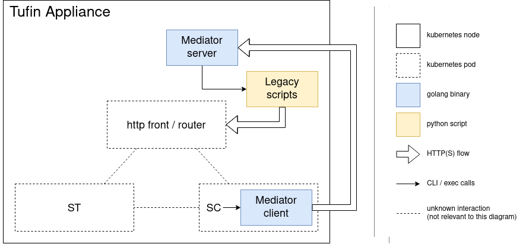

# uQuid-IT Mediator

# Context

uQuidIT provides this mediator script system to customize your workflow in Tufin TOS Aurora.

## General purpose

This system allows you to execute any external script to process your Securechange tickets. It is a convenient solution to use your legacy scripts developed for TOS Classic in an Aurora environment. 

These scripts will be executed on the main node instead of the Securechange pod, providing extra flexibility.

We assume you are familiar with Tufin Securechange and know how to configure it.

## Architecture overview

The main difficulty to overcome is that in the TOS Classic architecture, scripts are executed on the machine where SecureChange runs while in the TOS Aurora architecture, those scripts are supposed to run on a Kubernetes pod, which is very limited.

The solution is to deploy only a very small, self-contained executable on the pod: the `mediator-client`. This client will communicate with a `mediator-server`, which is hosted on a server that can execute the legacy scripts on behalf of the client.

The following diagram illustrates the interactions of the different elements involved.



# Build

## Get the code

You need to download the source code to build the executable file. 

To do so, clone our Github repository:
`$ git clone https://github.com/uquidit/mediator.git`

## Get Golang

You need Golang installed so you can build the binaries. Follow [this procedure](https://go.dev/doc/install) from the [go.dev](go.dev) web site.

## Build

3 binaries should be compiled:
* `mediator-client`
* `mediator-server`
* `mediator-cli`

You can compile them by going to their respective directories and run the `go build .` command. The binary will be created in current directory. Use teh `-o` flag to specify a destination directory.

* `mediator-client`  => `mediator/cmd/mediator-client`
* `mediator-server`  => `mediator/cmd/mediator-server`
* `mediator-cli`     => `mediator/cmd/mediator-cli`

### Set encryption keys

If you use mediator in production environment, you must change the following encryption keys:

Encryption algorithm uses 3 variables in `mediatorscript` package:
* `salt`
* `pepper`
* `secretKey`

And the One-Time password algorithm uses 2 in `totp` package:
* `secretMS1`
* `secretMS2`

They can all be set at build time using the `--ldflags` build flag with the `-X` command: 
`--ldflags="-X '<project name>/<package name>.<variable name>=<string value>'"`

Example:

```sh
$ go build --ldflags="\
-X 'uqtu/mediator/mediatorscript.salt=Hello' \
-X 'uqtu/mediator/mediatorscript.pepper=World' \
-X 'uqtu/mediator/mediatorscript.secretKey=ThisIsMySecret' \
-X 'uqtu/mediator/totp.secretMS1=Lorem' \
-X 'uqtu/mediator/totp.secretMS2=Ipsum' \
" .
```

Note: you can use escaped double-quotes to use spaces if required.

# Installation & Configuration

Mediator executables must be installed on your server.    

## Mediator-server

### Files

The `mediator-server` is composed of 3 files:

* The main executable file: `mediator-server`;
* The distribution configuration file: `mediator-server-dist.yml`. which will be used as a starting point for our configuration. It provides the comprehensive list of available configuration pieces along with their documentation;
* The Command-Line Interface (CLI) executable file: `mediator-cli` used to manage the server.

### Configuration

We provide a distribution configuration file named `mediator-server-dist.yml` as a starting point to build your own configuration.

You will find a comprehensive list of documented configuration entries.

We recommend that you keep an untouched copy of the original version of the distribution configuration file.

Follow these steps to configure the `mediator-server`:
1. Copy the distribution configuration file: `$ cp mediator-server-dist.yml mediator-server.yml`

2. Edit `mediator-server.yml` with your favorite text editor and set the required values according to your infrastructure and save the file

### Installation

1. Create the following destination folders on your server and make sure they are read and writeable for the user that will run `mediator-server` (likely to be the `tufin-admin` user)
   * `/opt/mediator/conf`
   * `/opt/mediator/bin`
   * `/opt/mediator/data`
2. Copy executable files to `/opt/mediator/bin` folder and set executable flag
3. Copy the configuration file to `/opt/mediator/conf` folder

### Start `mediator-server`

If you want the `mediator-server` to bind on a privileged port, it's necessary to grant the related special capability to it's binary file. This must be done after each installation as well as update. Run the following command:

`$ sudo setcap 'cap_net_bind_service=+ep' /opt/mediator/bin/mediator-server`

`mediator-server` expects the full path to its configuration file as the only argument.

If you’re testing the mediator, we recommend that you start the server in a “screen”:

```
$ screen -S mediator
$ /opt/mediator/bin/mediator-server /opt/mediator/conf/mediator-server.yml
```

Hit “Ctrl+a” then “d” to detach the screen without killing it. Use the following command to reattach:

`$ screen -r mediator`

If you’re installing the mediator on a production server, we recommend that you start it using systemd or other demon management software available on your system.

If you’re using systemd – which is likely to be – you can copy the provided file `cmd/mediator-server/mediator-server.service` into the `/etc/systemd/system` directory on the server:

```
$ sudo cp /tmp/mediator/mediator-server.service /etc/systemd/system
$ sudo systemctl daemon-reload
$ sudo systemctl enable mediator-server.service
```

You can check the service is enabled:

```
$ sudo systemctl is-enabled mediator-server.service
enabled
```

You can manage your service with the following commands:

* `sudo systemctl start mediator-server.service`
* `sudo systemctl stop mediator-server.service`
* `sudo systemctl status mediator-server.service`
* `sudo systemctl restart mediator-server.service`

### Command-line interface

The command-line interface is a convenient utility to easily interact with the mediator server. In order to use it, you need to provide the URL the mediator server listens to as the command line utility has no configuration file.

We suggest that you install it in the same folder as the server but it is not a requirement. In the following section, we will assume this is the case.

For instance, the following command will return the list of available commands:

```
$ /opt/mediator/bin/mediator-cli --url=http://xxx/v1/otp --help

This CLI provides commands to manage scripts used by Mediator back-end. It includes:

* List registered scripts
* Register new scripts
* Un-register useless scripts
* Refresh script checksum
* Test scripts

Usage:
  mediator [command]

Available Commands:
  completion      Generate the autocompletion script for the specified shell
  generate-config Generate a template configuration file for mediator-client
  help            Help about any command
  script          List available scripts for mediator. Available alias:'scripts'

Flags:
  -h, --help            help for mediator
      --sslskipverify   Skip SSL certificate verification (insecure)
  -u, --url string      Back-end URL (required)

Use "mediator [command] --help" for more information about a command.
```

The `--help` flag will always give you tips about how to use the CLI. 

A help message is available for all commands and subcommands. 

An alias may come handy when using the CLI so you don’t have to type the long server URL every time. There are different ways to do so, here is one of them using the alias command:

```
$ alias mediator="/opt/mediator/bin/mediator-cli --url=http://xxx/v1/otp"
```

In the following sections, we will use this alias in the commands we provide.

### Final configuration: script registration

`mediator-client` will request `mediator-server` to run some scripts when a ticket is processed under Securechange. Those scripts must explicitely be registered to the `mediator-server`. We will use `mediator-cli` for that purpose. 

4 different types of scripts can be used:

* **Trigger Scripts:**
  - `mediator-client` can be called when a workflow action is triggered. For instance, when a ticket advances or is submitted.
  - It will request the execution of any Trigger Script attached to the workflow step the ticket is in.
  - Mediator supports use of multiple Trigger Scripts so you can use different scripts to interact with your tickets at different steps of different workflows.
  - You can only attach one Trigger Script to a workflow step.
  - They run asynchronously
  - You can manage them using the `mediator scripts trigger` command and subcommands

* **“interactive” scripts**
  - They are 3 of them:
    - Scripted Condition scripts
    - Scripted Task scripts
    - Pre-Assignment scripts
  - `mediator-client` can be called when a ticket is in a step where a _scripted condition_, a _scripted task_ or _pre-assignment_ is required
  - It will  request the execution of any registered script of the corresponding type.
  - Only one script of each type can be registered on the server.
  - They run synchronously
  - You can manage them using the corresponding command and subcommands:
    - `mediator scripts condition [...]`
    - `mediator scripts task [...]`
    - `mediator scripts assignment [...]`

The commands `mediator scripts [trigger|condition|task|assignment]` all offer 4 subcommands:
* `refresh`
* `register`
* `test`
* `unregister`

All these subcommands work the same way regardless of the type of script.

All the scripts need to be registered before they can be executed by the server. You can use the following command for that purpose:

```
mediator scripts [trigger|condition|task|assignment] register
```

The command requires the script path as a unique argument. 

For instance, to register the “run.sh” script as a Trigger Script:

```
$ mediator scripts trigger register /path/to/script/run.sh
```

A new Trigger script named "run.sh" has been registered and linked to file `/path/to/script/run.sh`

All the scripts are registered under a name. This name must be unique in the script database. By default, the mediator will use the script file name as a name. However, you can provide a custom name using the `--name` flag.

Example:

```
$ mediator scripts trigger register /path/to/scripts/my-script.py --name MyScript
```

A new Trigger script named "MyScript" has been registered and linked to file `/path/to/scripts/my-script.py`

Script registration names are useful for trigger scripts. You will need the script name when you attach it to a workflow step in `mediator-client` configuration.

Check the scripts have been properly registered using the following command:

```
$ mediator scripts trigger 
Nb of Trigger script: 2
- run.sh: /path/to/scripts/run.sh
- MyScript: /path/to/scripts/my-script.py
```

You can unregister a script with the `unregister` command:

```
$ mediator scripts trigger unregister MyScript
Script 'MyScript' has been unregistered.

$ mediator scripts trigger 
Nb of Trigger script: 1
- run.sh: /path/to/scripts/run.sh
```

You can also unregister all the scripts of a given type by using the `unregister` subcommand with no argument

For security reasons, the server will not run a script that has been modified after it has been registered. If you do need to update a registered script, please run the following command after the script has been modified:

```
$ mediator script trigger refresh run.sh
Script ‘run.sh’ has been refreshed
```

All the subcommands described above are available for the other script types. Just change the trigger subcommand by the corresponding command name.

Top-level subcommands are also available. They will operate on all scripts, regardless of their type. Use the `--help` flag for more information.

## Mediator-client

### Configuration

The configuration file of `mediator-client` includes information about how it should connect to `mediator-server` and also about the scripts that need to be executed when a script reaches a particular step of a workflow.

`mediator-cli` will help us with creating this file by generating a template we can then amend. The previously registered “run.sh” script will be used as a default for all steps of all workflows.

Prior to running the following command, make sure that all the required workflows are properly configured and activated in Securechange.

```
$ mediator generate-config https://xxx/securechangeworkflow/api/securechange --script run.sh
```

Review the newly created `mediator-client.yml` file and make changes where necessary.

### Secondary scripts

`mediator-client` comes with 4 secondary scripts. Make sure they are available on the main node:

* `mediator-client-next-step.sh`: To be used instead of `mediator-client` when Securechange fires the trigger before the ticket has reach its step. It happens on the "Advance" trigger.
* `mediator-client-pre-assignment.sh`: To be used as "Pre-Assignment" script
* `mediator-client-scripted-condition.sh`: To be used as "Scripted condition" script
* `mediator-client-scripted-task.sh`: To be used as "Scripted task" script

### Upload to Securechange pod

6 files need to be uploaded to Securechange:
* mediator executable and configuration files:
  - `mediator-client`
  - `mediator-client.yml`
* 4 secondary scripts:
  - `mediator-client-next-step.sh`
  - `mediator-client-pre-assignment.sh`
  - `mediator-client-scripted-condition.sh`
  - `mediator-client-scripted-task.sh`


Upload them all to Securechange using the following command for each of the 6 previous files as argument:

```
$ sudo tos scripts sc push mediator-client
[Mar 20 23:59:57]  INFO Pushing from "mediator-client" to "."
[Mar 20 23:59:57]  INFO Done pushing files/folders
```
